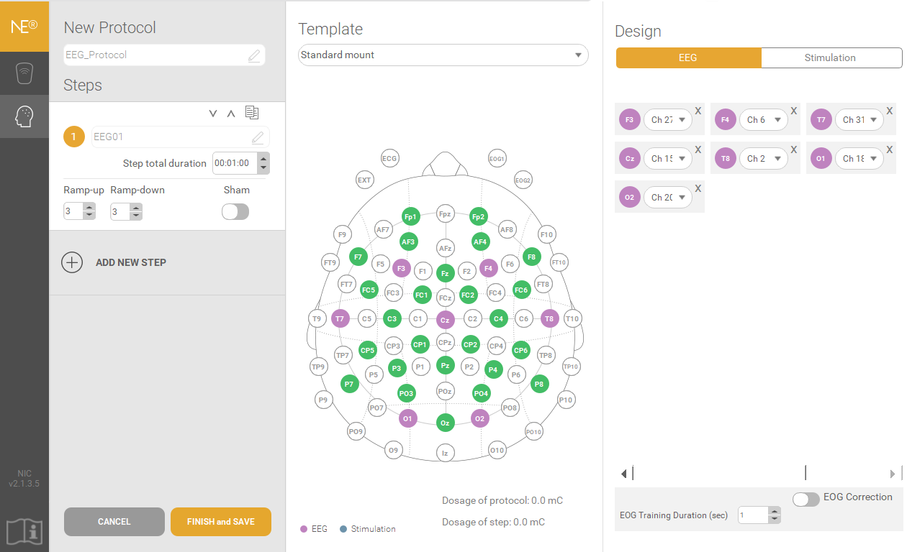
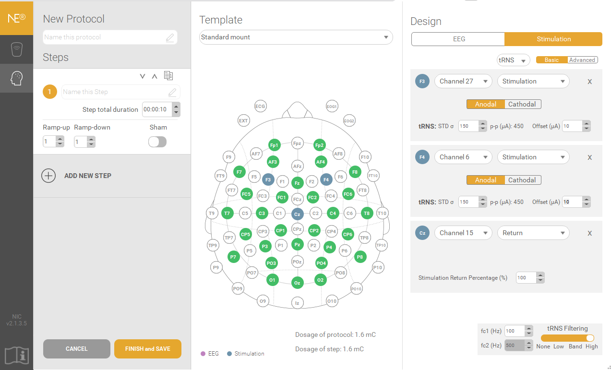
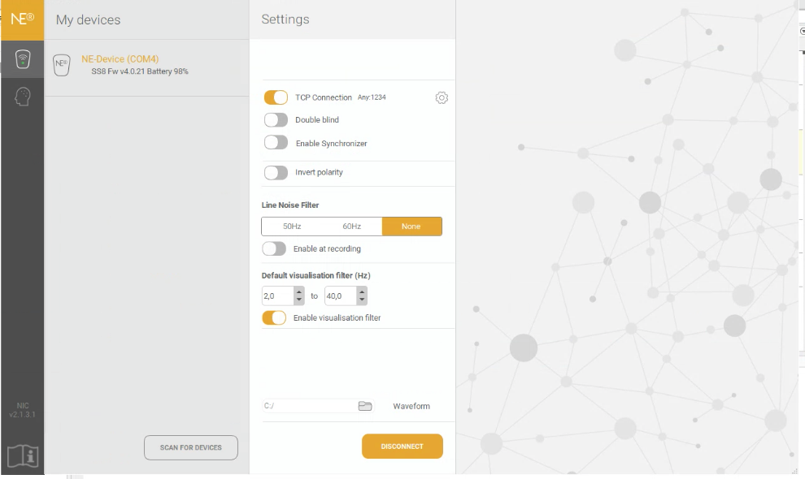
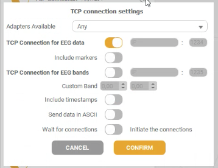
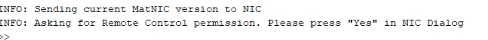
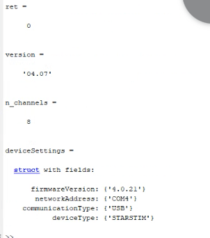
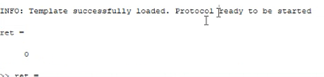
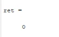

# Neuroelectric Closed-Loop setup
This README file outlines the setup for a closed-loop tRNS system that incorporates a non-aperiodic component from EEG data. It leverages Bayesian optimization to dynamically adjust stimulation parameters—specifically amplitude and frequency—based on real-time analysis of EEG signals. This method ensures optimal stimulation settings are identified and applied, enhancing tRNS effectiveness and specificity by adapting to the individual’s neural state.
___
This document provides a detailed, step-by-step guide designed to help users implement the setup from scratch.
Below, you will find a list of the essential components required for the setup, along with the specific versions used during development:

* MATLAB software (*Version 2023b*).
* MatNIC2 (*Version 4.10*, paid version). Included in the folder 'MatNIC2_v4.10_quoted version' on this repository.
* FOOOF Matlab wrapper (*v1.0.0*). [Link to repository](https://github.com/fooof-tools/fooof_mat/releases/tag/v1.0.0)
* NIC2 application (*Version 2.1.3.5*). [Link to Download](https://www.neuroelectrics.com/resources/software)
* Starstim 32 device.
* A PC equipped with WiFi and running Windows OS (*Windows 11 Pro*).

**MatNIC/Matlab and the NIC2 software are running on the same computer.**

Transmission Control Protocol (TCP) will be employed for streaming data. However, if Lab Streaming Layer (LSL) is utilized, please note that the LSL library for Matlab is included in the 'liblsl-Matlab' folder within this repository. It should be downloaded and added to the path.

## Step 1: Install Matlab.

Then
  * Download and add to the path the 'MatNIC2_v4.10_quoted version' folder.
    To interact with the software instrument controller (NIC2 software) and, in turn, with the Neuroelectric device connected to it.
    MatNIC provides control of the main functions of the software, namely, (1) Loading and launching EEG and stimulation protocols and (2) management of neurostimulation   online.
  * Download and add to the path 'FOOOF Matlab wrapper' for Spectral Parameterization. (File 'fooof_mat-1.0.0.zip' in this repository.)
    This is the tool to measure periodic and aperiodic properties of electrophysiological data.
    Donoghue et al. (2020). DOI: 10.1038/s41593-020-00744-x
    
## Step 2: Install NIC2 app.

Then
  * Pair NIC2 with a Starstim device. NIC2 utilizes the features of the most recently paired device to configure new protocols effectively.
    For detailed instructions on the pairing process, please refer to the 'Device Pairing' section in the NIC2 manual ('NE_P2_UM004_EN_NIC2.1.2_1.pdf').
  * Once the Starstim 32 has been paired at least once, utilize the NIC2 to generate protocols for EEG recording and tRNS stimulation.

    A template of the EEG protocol is  provided in the file 'EEG_Protocol.neprot'. The template is configured for a one-minute EEG recording with 7 channels. Please adjust the settings as needed.

A template of the tRNS protocol is provided in the file 'tRNS_Protocol.neprot'. The template is pre-configured for a 10-second stimulation duration, featuring a 3-second ramp-up and ramp-down period. The stimulation is exclusively delivered by F3 with a tRNS filtering between 100 Hz and 500 Hz (maximum value possible). The STD parameter is set to 150, and the Offset is set to 10. It's important to note that these settings are solely intended for testing purposes. The significance and impact of the STD and Offset parameters are complex and require further understanding and consideration. In essence, the tRNS protocol MUST be modified and tailored before actual usage.

## Step 3: Setting up NIC2.

On NIC2, turn on the TCP connections. Then, click on the small gear icon to the right for more details. See the figures below for reference:

## Step 4: Running script on Matlab.

In this final step, execute the MATLAB script containing all the necessary commands to accomplish various tasks, including:

1. Establishing a connection to the NIC.
2. Initiating the loop.
3. Recording EEG signals.
4. Estimating the aperiodic component.
5. Selecting amplitude and/or frequency parameters based on the aperiodic component using Bayesian optimization.
6. Implementing tRNS with the chosen parameters.
7. Concluding the loop.
   
The script, named **MOB_script.mat**, serves as the primary resource in the repository. Please note that it is a work in progress.

Below is an example of MATLAB code to achieve point 1, "Connection to NIC":

`% connect to socket`

`close all`

`clear all`

`clc`

`[ret, status, socket] = MatNICConnect('localhost')`

 

NIC then will ask for remote control using an emergent window. Manually, confirm control on NIC before the socket is closed.

` % checking on `

`[ret, version, n_channels, deviceSettings] = MatNICSetUp (socket)`

  

Before running the next line of code, ensure that your protocol is imported on NIC

`% Load MatNIC protocol`

`ret = MatNICLoadProtocol ('Stim', socket)`
 
  

`% Start MatNIC protocol`

`[ret] = MatNICStartProtocol (socket)`
 
  

